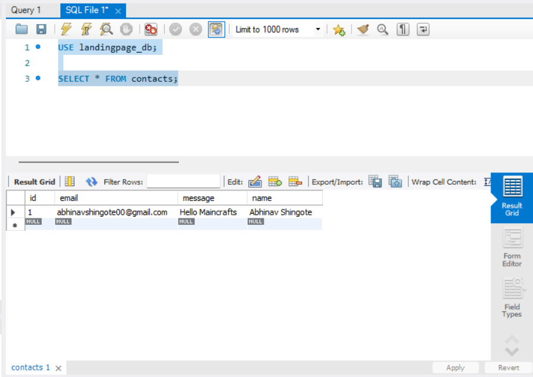
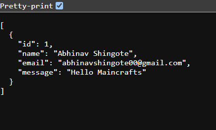

# 🚀 Maincrafts Technology Internship – Task 2

## 📌 Project Name

**Abhinav Portfolio – Contact Form with Spring Boot & MySQL**

This project was developed as part of the **Maincrafts Technology Java Full Stack Web Development Internship (Task 2)**.

---

## 📖 Project Description

This project extends the landing page created in Task 1 by integrating a **MySQL database** using **Spring Data JPA (Hibernate)**.

Users can submit their details through the contact form, and the information is stored in the MySQL database. A REST API endpoint (`/contacts`) is also provided to retrieve all submitted contact details in JSON format.

---

## ✨ Features

- 🌐 Responsive Landing Page
- 🎨 Modern Dark Blue UI
- 🧭 Navigation Bar
- 👨‍💻 About Section
- 💼 Services Section
- 📬 Contact Form
- ☕ Spring Boot Backend
- 🗄️ MySQL Database Integration
- 📦 Spring Data JPA (Hibernate)
- 💾 Stores Contact Details in Database
- 🔗 REST API (`/contacts`)
- 📄 JSON Response
- 📱 Mobile Friendly

---

## 🛠 Technologies Used

- HTML5
- CSS3
- Java 21
- Spring Boot
- Spring Data JPA
- Hibernate
- MySQL
- Maven
- IntelliJ IDEA
- MySQL Workbench
- Git & GitHub

---

## 📂 Project Structure

```text
landingpage
│
├── src
│   ├── main
│   │   ├── java
│   │   │   └── com.abhinav.landingpage
│   │   │       ├── controller
│   │   │       │   └── ContactController.java
│   │   │       ├── model
│   │   │       │   └── Contact.java
│   │   │       ├── repository
│   │   │       │   └── ContactRepository.java
│   │   │       └── LandingpageApplication.java
│   │   │
│   │   └── resources
│   │       ├── static
│   │       │   ├── index.html
│   │       │   └── style.css
│   │       └── application.properties
│   │
│   └── test
│
├── screenshots
├── pom.xml
├── mvnw
├── mvnw.cmd
└── README.md
```

---

## 🗄️ Database Configuration

Database Name

```sql
landingpage_db
```

Table Name

```sql
contacts
```

Spring Boot automatically creates the table using Hibernate.

---

## 🔗 REST API

### Get All Contacts

```http
GET /contacts
```

Example Output

```json
[
  {
    "id": 1,
    "name": "Abhinav Shingote",
    "email": "abhinavshingote00@gmail.com",
    "message": "Hello Maincrafts"
  }
]
```

---

## ▶️ How to Run

### 1. Clone the repository

```bash
git clone https://github.com/AbhinavShingote/maincrafts-task-2-springboot-mysql.git
```

### 2. Open the project in IntelliJ IDEA

### 3. Create a MySQL database

```sql
CREATE DATABASE landingpage_db;
```

### 4. Update `application.properties`

```properties
spring.datasource.url=jdbc:mysql://localhost:3306/landingpage_db
spring.datasource.username=root
spring.datasource.password=YOUR_PASSWORD

spring.jpa.hibernate.ddl-auto=update
spring.jpa.show-sql=true
```

### 5. Run

```
LandingpageApplication.java
```

### 6. Open

```
http://localhost:8080
```

Submit the contact form.

### 7. View all contacts

```
http://localhost:8080/contacts
```

---

# 📸 Project Screenshots

## 🏠 Home Page


---

## 👨‍💻 About Section


---

## 💼 Services Section


---

## 📬 Contact Form


---

## 🖥 IntelliJ Console


---

## 🗄️ MySQL Database



---

## 🔗 REST API Output



---

## 👨‍💻 Author

**Abhinav Shingote**

Computer Engineering Student

MIT Academy of Engineering (MITAOE)

---

## 🎯 Internship

**Maincrafts Technology**

Java Full Stack Web Development Internship

**Task 2**

---

## ⭐ GitHub Repository

https://github.com/AbhinavShingote/maincrafts-task-2-springboot-mysql

---

### Thank you for visiting this repository! 😊