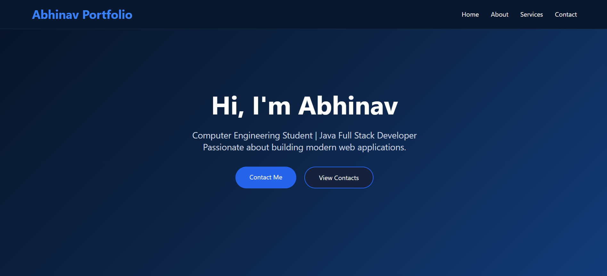
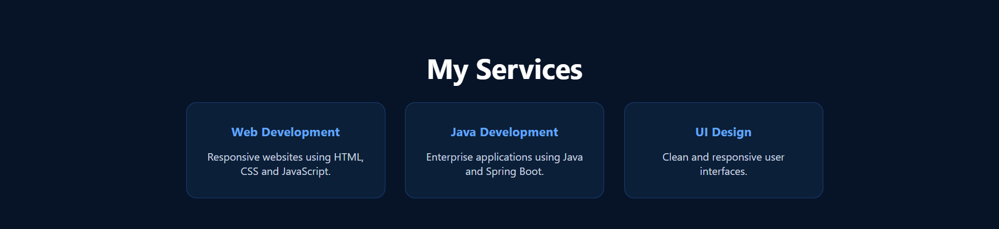
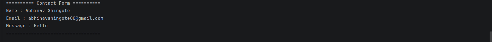

# 🚀 Maincrafts Technology Internship – Task 1

## 📌 Project Name

**Abhinav Portfolio – Landing Page with Contact Form**

This project was developed as part of the **Maincrafts Technology Java Full Stack Web Development Internship (Task 1)**.

---

## 📖 Project Description

A responsive portfolio-style landing page developed using **HTML**, **CSS**, and **Spring Boot**. The application includes a contact form that sends user details to the Spring Boot backend using a **POST request**, where the submitted data is displayed in the IntelliJ console.

---

## ✨ Features

- 🌐 Responsive Landing Page
- 🎨 Modern Dark Blue UI
- 🧭 Navigation Bar
- 👨‍💻 About Me Section
- 💼 Services Section
- 📬 Contact Form
- ☕ Spring Boot Backend
- 📨 POST Request Handling
- 🖥 Console Output
- 📱 Mobile Friendly

---

## 🛠 Technologies Used

- HTML5
- CSS3
- Java
- Spring Boot
- Maven
- IntelliJ IDEA
- Git & GitHub

---

## 📂 Project Structure

```
landingpage
│
├── src
│   ├── main
│   │   ├── java
│   │   │   └── com.abhinav.landingpage
│   │   │       ├── LandingpageApplication.java
│   │   │       └── controller
│   │   │           └── ContactController.java
│   │   │
│   │   └── resources
│   │       ├── static
│   │       │   ├── index.html
│   │       │   └── style.css
│   │       └── application.properties
│   │
│   └── test
│
├── pom.xml
├── mvnw
├── mvnw.cmd
└── README.md
```

---

## ▶️ How to Run

1. Clone the repository.

```bash
git clone https://github.com/AbhinavShingote/maincrafts-task-1-landing-page.git
```

2. Open the project in **IntelliJ IDEA**.

3. Run:

```
LandingpageApplication.java
```

4. Open your browser and visit:

```
http://localhost:8080
```

5. Fill out the contact form.

6. Click **Send Message**.

7. View the submitted data in the IntelliJ console.

---

# 📸 Project Screenshots

## 🏠 Home Page



---

## 👨‍💻 About Section


---

## 💼 Services Section



---

## 📬 Contact Form


---

## 🖥 Console Output



---

## 👨‍💻 Author

**Abhinav Shingote**

Computer Engineering Student

MIT Academy of Engineering (MITAOE)

---

## 🎯 Internship

**Maincrafts Technology**

Java Full Stack Web Development Internship

**Task 1**

---

## ⭐ GitHub Repository

https://github.com/AbhinavShingote/maincrafts-task-1-landing-page

---

### Thank you for visiting this repository! 😊