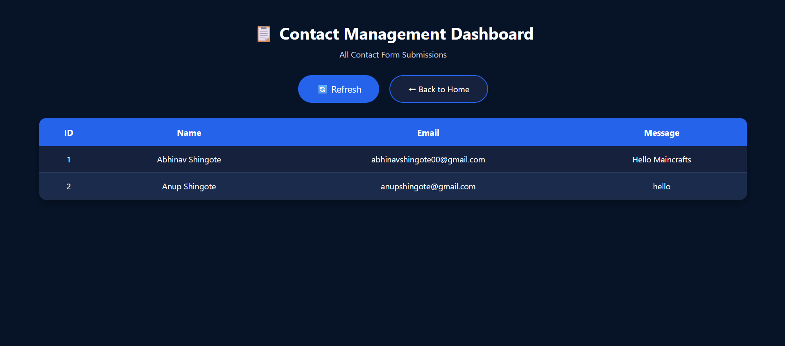

# 🚀 Maincrafts Technology Internship – Task 3

## 📌 Project Name

**Abhinav Portfolio – Contact Management Dashboard**

This project was developed as part of the **Maincrafts Technology Java Full Stack Web Development Internship (Task 3)**.

---

## 📖 Project Description

This project extends the landing page created in **Task 2** by adding a **Contact Management Dashboard**.

Users can submit their details through the contact form, and the information is stored in a **MySQL database** using **Spring Data JPA (Hibernate)**. The dashboard retrieves all stored contacts using a **Spring Boot REST API** and displays them dynamically using the **JavaScript Fetch API**.

The project demonstrates the integration of frontend and backend technologies to build a complete Contact Management System.

---

## ✨ Features

- 🌐 Responsive Landing Page
- 🎨 Modern Dark Blue UI
- 🧭 Navigation Bar
- 👨‍💻 About Section
- 💼 Services Section
- 📬 Contact Form
- ☕ Spring Boot Backend
- 🗄️ MySQL Database Integration
- 📦 Spring Data JPA (Hibernate)
- 💾 Stores Contact Details in Database
- 🔗 REST API (`/contacts`)
- 📋 Contact Management Dashboard
- ⚡ JavaScript Fetch API
- 🔄 Refresh Contacts Button
- 🏠 Back to Home Button
- 📱 Mobile Friendly

---

## 🛠 Technologies Used

- HTML5
- CSS3
- JavaScript
- Java 21
- Spring Boot
- Spring Data JPA
- Hibernate
- MySQL
- Maven
- IntelliJ IDEA
- MySQL Workbench
- Git & GitHub

---

## 📂 Project Structure

```text
landingpage
│
├── src
│   ├── main
│   │   ├── java
│   │   │   └── com.abhinav.landingpage
│   │   │       ├── controller
│   │   │       │   └── ContactController.java
│   │   │       ├── model
│   │   │       │   └── Contact.java
│   │   │       ├── repository
│   │   │       │   └── ContactRepository.java
│   │   │       └── LandingpageApplication.java
│   │   │
│   │   └── resources
│   │       ├── static
│   │       │   ├── index.html
│   │       │   ├── contacts.html
│   │       │   └── style.css
│   │       └── application.properties
│   │
│   └── test
│
├── screenshots
├── pom.xml
├── mvnw
├── mvnw.cmd
└── README.md
```

---

## 🗄️ Database Configuration

### Database Name

```sql
landingpage_db
```

### Table Name

```sql
contacts
```

Spring Boot automatically creates the table using Hibernate.

---

## 🔗 REST API

### Get All Contacts

```http
GET /contacts
```

### Example Output

```json
[
  {
    "id": 1,
    "name": "Abhinav Shingote",
    "email": "abhinavshingote00@gmail.com",
    "message": "Hello Maincrafts"
  }
]
```

---

## 📋 Contact Dashboard

Open:

```
http://localhost:8080/contacts.html
```

The Contact Dashboard retrieves all submitted contact details from the `/contacts` REST API using the JavaScript Fetch API and displays them in a responsive table.

### Dashboard Features

- View all submitted contacts
- Refresh contact list
- Back to Home button
- Responsive table layout
- Dynamic data loading without page reload

---

## ▶️ How to Run

### 1. Clone the repository

```bash
git clone https://github.com/AbhinavShingote/maincrafts-task-3-contact-dashboard.git
```

### 2. Open the project in IntelliJ IDEA

### 3. Create a MySQL database

```sql
CREATE DATABASE landingpage_db;
```

### 4. Update `application.properties`

```properties
spring.datasource.url=jdbc:mysql://localhost:3306/landingpage_db
spring.datasource.username=root
spring.datasource.password=YOUR_PASSWORD

spring.jpa.hibernate.ddl-auto=update
spring.jpa.show-sql=true
```

### 5. Run

```
LandingpageApplication.java
```

### 6. Open the Landing Page

```
http://localhost:8080
```

Submit the contact form.

### 7. View the Dashboard

```
http://localhost:8080/contacts.html
```

### 8. View REST API

```
http://localhost:8080/contacts
```

---

# 📸 Project Screenshots

## 🏠 Home Page


---

## 👨‍💻 About Section


---

## 💼 Services Section


---

## 📬 Contact Form


---

## 📋 Contact Dashboard



---

## 🖥 IntelliJ Console


---

## 🗄️ MySQL Database


---

## 🔗 REST API Output


---

## 👨‍💻 Author

**Abhinav Shingote**

Pre-Final Year B.Tech Computer Engineering Student

MIT Academy of Engineering (MITAOE), Pune

---

## 🎯 Internship

**Maincrafts Technology**

Java Full Stack Web Development Internship

**Task 3**

---

## ⭐ GitHub Repository

https://github.com/AbhinavShingote/maincrafts-task-3-contact-dashboard

---

### Thank you for visiting this repository! 😊